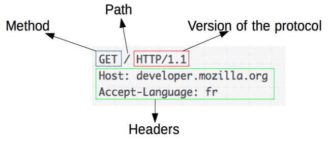
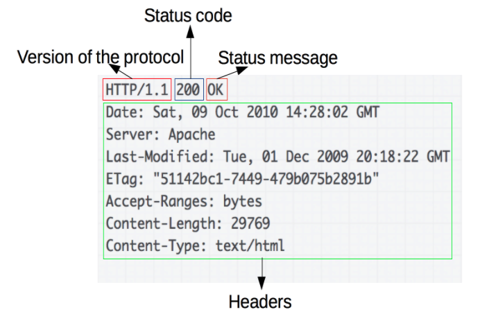

## HTTP

- HTTPis a **protocol** which allows the fetching of resources, such as HTML documents. It is the foundation of any data exchange on the Web and it is a **client-server protocol**, which means requests are initiated by the recipient, usually the Web browser.  It is an application layer protocol that is sent over TCP, or over a TLS-encrypted TCP connection, though any reliable transport protocol could theoretically be used. A complete document is reconstructed from the different sub-documents fetched, for instance text, layout description, images, videos, scripts, and more.

- Experiment:

  - request

    ```markdown
    GET / HTTP/1.1
    Host: developer.mozilla.org
    Accept-Language: fr
    ```

    

  - 常用的request head类型

    - Accept:表示可接受数据的类型
    
    - Accept-Language: 语言类型
    
    - User-Agent: 客户端浏览器信息
    
    - Host: 请求时服务器的ip和port
    
      
    
  - response

    ```markdown
    HTTP/1.1 200 OK
    Date: Sat, 09 Oct 2010 14:28:02 GMT
    Server: Apache
    Last-Modified: Tue, 01 Dec 2009 20:18:22 GMT
    ETag: "51142bc1-7449-479b075b2891b"
    Accept-Ranges: bytes
    Content-Length: 29769
    Content-Type: text/html
    
    <!DOCTYPE html... (here comes the 29769 bytes of the requested web page)
    ```

    

  

  - 常用的响应Head类型
    - Server: 服务器的信息
    - Content-Type: 响应体的数据类型
    - Content-Type: 响应体的长度
    - Date: 请求响应的时间
  - 常见响应码
    - 200   成功
    - 302   请求重新定向
    - 404   服务器收到请求,但是资源不存在(地址错误)
    - 500   服务器收到请求,但内部出错

---

## RESTFul

- Representational State Transfer
- GET --> read
- POST --> create, update
- PUT --> update
- DELETE  --> delete

---

## About XML

- eXtensible Markup Language, 可扩展标记语言,是一种程序与程序之间传输数据的标记语言

  ```xml
  <?xml version="1.0" encoding="UTF-8" ?>
  <!DOCTYPE note SYSTEM "book.dtd">
  <book id="1">
      <name>Java</name>
      <author>Cay S. Horstmann</author>
      <isbn lang="CN">1234567</isbn>
      <tags>
          <tag>Java</tag>
          <tag>Network</tag>
      </tags>
      <pubDate/>
  </book>
  ```

- XML Downside
  - 文件格式庞大复杂,内存占用大传输占用带宽
  - 服务端课客户端需要大量的代码解析
  - 不同浏览器之间解析XML的方式不一样

- XML的解析API

  - Document Object Model (DOM)：一次性读取XML，并在内存中表示为树形结构

    ```java
    InputStream input = Main.class.getResourceAsStream("/book.xml");
    DocumentBuilderFactory dbf = DocumentBuilderFactory.newInstance();
    DocumentBuilder db = dbf.newDocumentBuilder();
    Document doc = db.parse(input);
    ```

  - Simple API for XML (SAX)：它是一种基于流的解析方式，边读取XML边解析，并以事件回调的方式让调用者获取数据。因为是一边读一边解析，所以无论XML有多大，占用的内存都很小。

    ```java
    InputStream input = Main.class.getResourceAsStream("/book.xml");
    SAXParserFactory spf = SAXParserFactory.newInstance();
    SAXParser saxParser = spf.newSAXParser();
    saxParser.parse(input, new MyHandler());
    ```

---

## JSON

- javascript object notation, 新型的轻量级数据交换格式

  ```json
  {
      "id": 1,
      "name": "Java核",
      "author": {
          "firstName": "Abc",
          "lastName": "Xyz"
      },
      "isbn": "1234567",
      "tags": ["Java", "Network"]
  }
  ```

  

- Upside

  - JSON只允许使用UTF-8编码，不存在编码问题

  - JSON只允许使用双引号作为key，特殊字符用`\`转义，格式简单；

  - 格式是压缩的,占用带宽小

  - 浏览器内置JSON支持，如果把数据用JSON发送给浏览器，可以用JavaScript直接处理

  - 支持多种语言

  - 能够直接被服务端的代码使用,简化代码开发量

    

- JSON的解析API

  - Jackson

    ```java
    InputStream input = Main.class.getResourceAsStream("/book.json");
    ObjectMapper mapper = new ObjectMapper();
    // 反序列化时忽略不存在的JavaBean属性:
    mapper.configure(DeserializationFeature.FAIL_ON_UNKNOWN_PROPERTIES, false);
    Book book = mapper.readValue(input, Book.class);
    ```

    

---

## CURL

- 以命令的方式来执行HTTP协议的请求工具

- 可以通过CURL操作HTTP的GET/POST/PUT/DELETE方法

- 访问一个网页

  ```shell
  curl www.google.com     //default is get
  ```

  

- 现实http response的头信息

  ```shell
  curl -i www.google.com
  ```

  

- 显示一次http请求的通信过程

  ```shell
  curl -v www.google.com
  ```

  

- 执行GET/POST/PUT/DELETE方法

  ```java
  curl -X GET/POST/PUT/DELETE www.google.com
  ```

  

