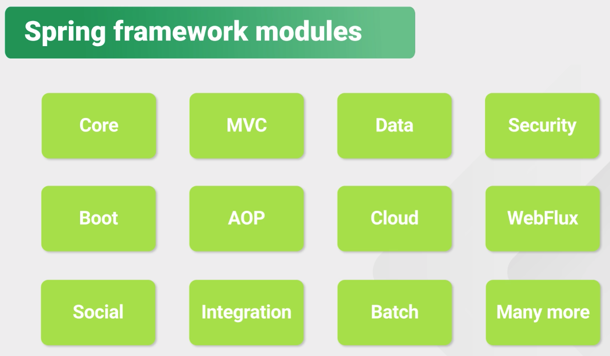
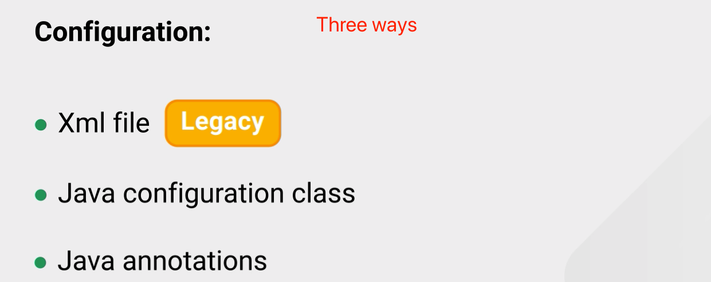
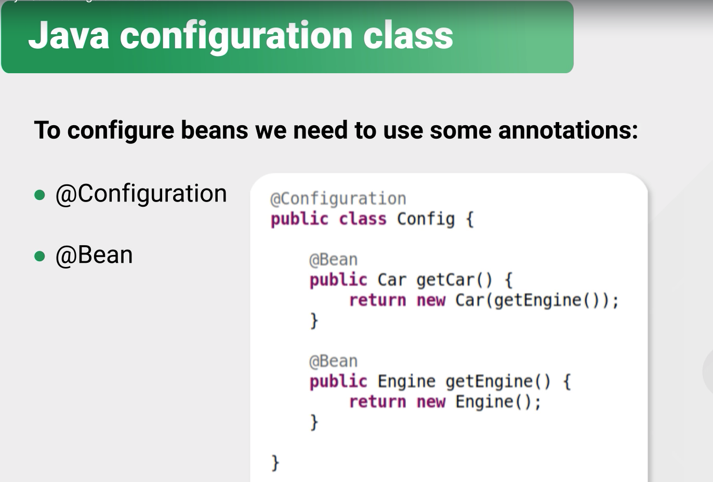

# Spring Core


|       Keyword        |                                                              |
| :------------------: | ------------------------------------------------------------ |
|         IoC          | Inversion of Control (IoC) / Dependency Injection (DI)       |
|   Spring Container   | Core, Bean,Context,SpEl                                      |
|      **@Bean**       | an object that is instantiated, assembled, and managed by a spring IoC container |
|   **@scope("<>")**   | default: singleton,  Prototype                               |
| Dependency Injection | one object supplies the dependencies of another object       |
|  Configuration IoC   | xml file,  java configuration class, java annotations        |
|  **@Configuration**  | used over the Congif class name                              |
|    **@Component**    | over the class, define beans,  bean name is: lowercase with class name |
|  **@ComponentScan**  | over config class;  includes controller, service, repository. <br />@ComponentScan(basePackages = ”name”) |
|    **@Autowired**    | inject beans into components                                 |
|    **@Qualifier**    | used in different implementation of bean                     |
|     **@Primary**     | used in same implementation of bean                          |
|       Bean Id        | a unique name that allows Spring to recognize each bean      |
|      **@Value**      | use value from properties file                               |
|     Environment      | use value form properties file                               |
| **@PropertySource**  | used over config class  *@PropertySource*("classpath:application.properties") |
|     **@Profile**     | allow us to configure an application in a different way for a different environment |

**Spring MVC**

**Spring Data wieh Hibernate**

**Spring Security**

**REST**

**Spring Boot**

Advantage:

​	Inversion of Control container with Dependency injection

​	AOP

​	POJO



---

## Spring Container


---

## Bean


**default bean is singleton**

---

## Inversion of Control / DI (programming principle)

https://en.wikipedia.org/wiki/Inversion_of_control

- Developer is no longer responsible for managing objects life cycle.
- Outsourcing the process of creating and managing bojects to an IOC container.








```java
@Component
public class MailService {
    ...
}
```

这个`@Component`注解就相当于定义了一个Bean，它有一个可选的名称，默认是`**mailService**`，即小写开头的类名。


Only one profile can be active at the same time, and bean without profile, not everyonewill be created always.

