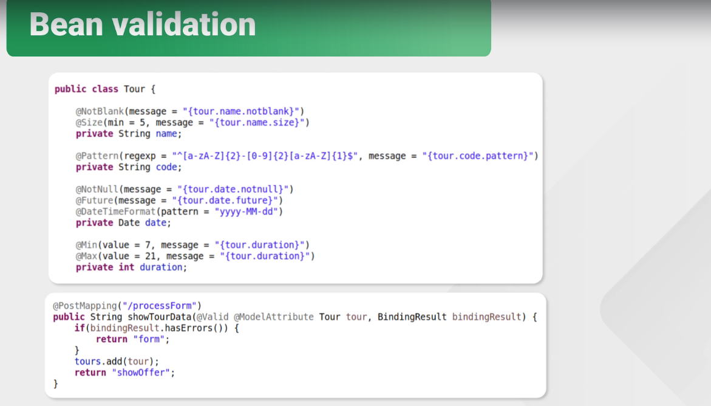

# Spring MVC

- Model - View - Controller pattern
  - **Model**: 将与业务逻辑相关的数据封装为具体的JavaBean类,其中不参杂任何与数据处理相关的代码.(JavaBean/domain/entity/pojo)
  - **View**: 负责数据和界面的显示,不接受任何与显示数据无关的代码(JSP(Java Service Page)/HTML)
  - **Controller**: 接受请求,调用代码处理请求,派发页面, 调度者角色--servlet. 转到某个页面,或者重新定向某个页面.

-  build web application
- 目的: uncoupled
- 使用Spring MVC开发Web应用程序的主要工作就是编写Controller逻辑。
- https://zhuanlan.zhihu.com/p/99923426
- 

|            Key Concepts             |                                                              |
| :---------------------------------: | ------------------------------------------------------------ |
| **Spring MVC Web应用程序启动顺序:** | 1.启动Tomcat服务器； 2.Tomcat读取web.xml并初始化**DispatcherServlet**； 3.**DispatcherServlet**创建IoC容器并自动注册到ServletContext中。 4.启动后，浏览器发出的HTTP请求全部由**DispatcherServlet**接收，并根据配置转发到指定Controller的指定方法处理。 |
|       **Dispatcher Servlet**        | The Dispatcher Servlet is responsible for taking every incoming request and sending it to the appropriate method from the **controller**. |
|          **@EnableWebMvc**          | 编写正常的`Config`后，只需加上`@EnableWebMvc`注解，就“激活”了Spring MVC： |
|          **ViewResolver**           | ViewResolver is responsible for receiving appropriate view using method name retrieved from the Controller. Spring MVC允许集成任何模板引擎，使用哪个模板引擎，就实例化一个对应的`ViewResolver` 通过指定prefix和suffix来确定如何查找View。指定模板文件存放在`/WEB-INF/templates/`目录下 |
|           **@Controller**           | Controller is to get a request and send the response 一个方法对应一个HTTP请求路径，用`@GetMapping`或`@PostMapping`表示GET或POST请求： |
|         Mapping annotations         | are used to tell the **Dispatcher Servle**t which method should be called |
|           @RequestMapping           | @RequestMapping("/main");  @RequestMapping(path = "main", method = RequestedMethod.GET) |
|                                     | @GetMapping('main')  @PostMapping()  . . .         |
|         **@RequestParam()**         | 需要接受HTTP参数 如果方法参数需要传入`HttpServletRequest`、`HttpServletResponse`或者`HttpSession`， |

